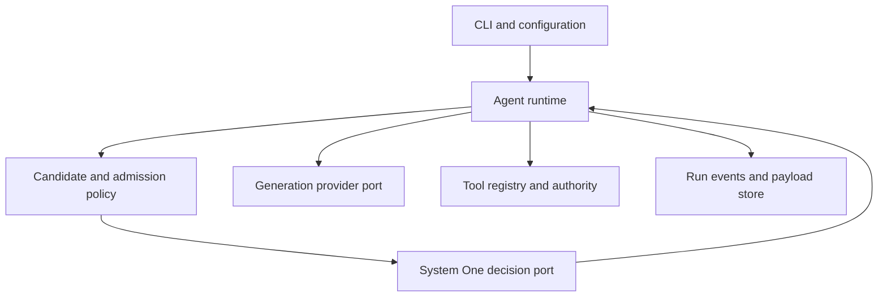

# Rahu architecture

Rahu has a decision plane that makes bounded judgments and an execution plane that performs generation and validated tools. Its distinctive unit is an **execution candidate**: a legal tuple of model, reasoning policy, and provider constraints. The runtime owns authority and ordering.

## Boundaries

| Module | Owns | Depends on |
|---|---|---|
| `rahu-core` | Immutable domain types, state transitions, candidate filtering, budgets, tool contracts, events | JDK; no provider SDK |
| `rahu-openrouter` | Catalog parsing, capability evidence, generation HTTP mapping, provider continuation envelope | core, JSON library |
| `rahu-systemone` | Typed decision HTTP protocol, compatibility profiles, response validation | core, JSON library |
| `rahu-cli` | Configuration, composition, CLI, JSONL persistence, evaluation/replay commands | core and both adapters |

Initially use packages and dependency tests rather than mandatory JPMS descriptors. Add module-system boundaries when their benefit exceeds tooling friction. No dependency from core to CLI or an adapter. A public interface must justify its substitution boundary, not mirror every class.

## Domain contracts

The following names are design contracts, not source stubs. Implement precise types while preserving these invariants.

| Type | Required fields and invariants |
|---|---|
| `ModelRef` | Provider-neutral ID; adapter resolves canonical generation identity |
| `ModelProfile` | Context/output limits, capability evidence, pricing snapshot, reasoning metadata, provenance and freshness |
| `ReasoningPolicy` | `ProviderDefault`, explicit supported effort, or disabled when supported; default and none are distinct |
| `ExecutionCandidate` | Stable local candidate ID, model, reasoning policy, provider constraints, catalog/config hashes |
| `DecisionContext` | Operation kind, bounded untrusted request/state, trusted constraints, schema/prompt version |
| `DecisionOutcome` | Validated typed result or typed failure; raw confidence semantics and optional probability distribution |
| `RouteResolution` | Suggested route, executed route, mode, fallback/escalation cause, constraints and exclusions |
| `RunState` | Immutable transcript references, step count, deadline, ledger, pending calls, active route, termination |
| `ModelOutcome` | Answer, proposed tool batch, or typed failure; usage and continuation envelope kept separate |
| `ToolOutcome` | Success, denied, invalid, failed, cancelled, or indeterminate; bounded content and provenance |
| `Money` | Currency plus exact decimal; unknown is separate from numeric zero |
| `SessionState` | In-process session ID, turn count/history, aggregate ledger, active-turn ownership; reset never clears liability |
| `ContextItem` | Kind, provenance, independent trust/privacy classification, local original/safe-view reference/hash, order and token allowance |
| `ContextPlan` | Deterministic prompt/projection, pinned units, compaction requirement, source/template hashes |

Do not make every reasoning value a separate record merely to demonstrate sealed interfaces. An enum is appropriate for the current finite effort vocabulary; a sealed policy separates fundamentally different states. Constructors enforce local invariants. Cross-field validation produces actionable configuration errors before paid calls.

## Run flow

1. Resolve configuration and immutable catalog snapshot. Validate baseline/fallback and reserve trace storage.
2. Build a locally approved non-sensitive/synthetic view and apply the privacy gate before classification or paid reservation. System One classifies the task and selects advisory tool relevance. Trusted operation requirements cannot be relaxed by those answers.
3. Code creates and orders feasible candidates. System One selects one jointly covering model and reasoning; Java validates the result.
4. Resolve shadow/active execution policy and reserve estimated spend. Invoke one generation request.
5. Preserve the assistant response and provider continuation data. Validate and authorise proposed tool calls; execute admissible calls serially in MVP.
6. Append linked tool observations. Continue within model-step, time, token, and cost admission limits. Reroute only at compatible boundaries.
7. At context pressure, System One chooses a bounded compaction policy and summary candidate. Generation produces the summary; deterministic checks protect pinned state and call/result pairs.
8. Emit one terminal outcome and reconcile the ledger. Cleanup scopes, HTTP resources, and trace files even on cancellation.

See [runtime](docs/specs/runtime.md) for terminal semantics and [routing](docs/specs/routing.md) for the exact selection algorithm.

## Seven subsystem responsibilities

See [the coverage map](docs/harness-subsystems.md) for explicit owners and tests. The four modules cover seven conceptual areas without adding modules for each. Core owns run/session/context policy and authority; adapters map prompts/continuation/protocols; CLI owns composition, session interaction, registry lifecycle and persistence surfaces.

[Context](docs/specs/context.md) defines in-process follow-up, provenance, instruction/prompt assembly and source-safe compaction. [Safety](docs/specs/safety.md) defines the common admission path. [Orchestration](docs/specs/orchestration.md) explicitly disables sub-agents and defines owner/cancellation/no-progress behavior. [Extensibility](docs/specs/extensibility.md) defines compiled-in ports and registry contracts. No subsystem's completeness is inferred merely from a box in this diagram.

Perform context planning before concluding no route can fit: context-only exclusions may trigger admitted summarisation then a bounded candidate rebuild. Every request, including decisions and summaries, follows deterministic authority, [safe-view/final serialisation privacy checks](docs/specs/privacy.md) and hierarchical cost admission. Unknown/restricted content blocks; read access never grants disclosure rights. A conversation reset cannot erase session or experiment liabilities.

## Important design decisions

- Own the agent loop; use libraries as utilities/adapters. [ADR 0001](docs/adr/0001-own-loop.md)
- System One advises within deterministic authority. [ADR 0002](docs/adr/0002-decision-plane.md)
- Joint candidates preserve model-aware effort semantics. [ADR 0003](docs/adr/0003-execution-candidates.md)
- Java 27 with justified preview features and one toolchain. [ADR 0004](docs/adr/0004-java-preview.md)
- JSONL observability without an event-sourced runtime. [ADR 0005](docs/adr/0005-traces-and-replay.md)
- Explicit configured pools and shadow-first adoption. [ADR 0006](docs/adr/0006-configuration-and-shadow.md)
- Seven-area alpha with in-process sessions and continuous build through M2. [ADR 0007](docs/adr/0007-seven-subsystem-alpha.md)
- Local safe-view/privacy admission before every model operation. [ADR 0008](docs/adr/0008-outbound-privacy.md)

## Deferred extensions

Resumable sessions need a persistent tool journal and recovery protocol. MCP needs separate trust and permission semantics. Native inference needs tokenizer parity, lifecycle and packaging evidence. Learned routing needs counterfactual labels and held-out evaluations. Multi-agent orchestration needs a strong single-agent baseline and shared budget semantics. None is implemented by pre-creating abstractions for hypothetical future systems.
